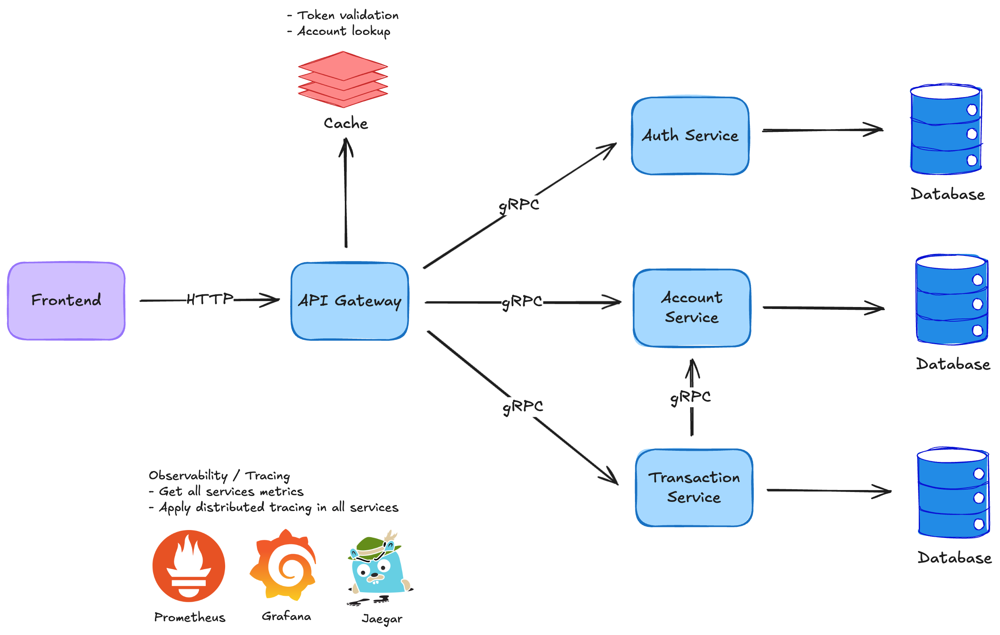

# Mini Bank

A microservices-based banking system built with Go, featuring authentication, account management, and transaction processing with a React frontend.

## Architecture



**Services:**

| Service             | Port         | Description                                                                                |
| ------------------- | ------------ | ------------------------------------------------------------------------------------------ |
| **api-gtw**         | 8080 (HTTP)  | REST API gateway — routes client requests to backend services via gRPC                     |
| **svc-auth**        | 50051 (gRPC) | Authentication & user management — JWT tokens, refresh tokens, password change             |
| **svc-account**     | 50052 (gRPC) | Account management — creation, balance tracking, debit/credit with pessimistic locking     |
| **svc-transaction** | 50053 (gRPC) | Transaction processing — transfers, deposits, withdrawals, 5% withdrawal fee, saga pattern |
| **web**             | 5173 (dev)   | React SPA — user banking interface                                                         |

## Tech Stack

- **Language**: Go 1.24
- **HTTP Framework**: Gin
- **Frontend**: React 19, TypeScript, TanStack Router & React Query, Tailwind CSS
- **Service Communication**: gRPC (protobuf3)
- **Databases**: PostgreSQL (database-per-service)
- **Cache**: Redis
- **Message Queue**: RabbitMQ
- **Observability**: OpenTelemetry (Jaeger for tracing, Prometheus + Grafana for metrics)
- **CI/CD**: GitHub Actions (Docker Hub multi-service matrix build)
- **Testing**: Go `testing` + testify

## Project Structure

```
minibank/
├── apps/
│   ├── api-gtw/              # HTTP REST gateway (port 8080)
│   ├── svc-auth/             # Auth service (gRPC :50051)
│   ├── svc-account/          # Account service (gRPC :50052)
│   ├── svc-transaction/      # Transaction service (gRPC :50053)
│   └── web/                  # Frontend (React + Vite)
├── packages/
│   ├── protos/               # Protocol buffer definitions
│   ├── jwt/                  # JWT token management
│   ├── password/             # Password hashing (bcrypt)
│   ├── cache/                # Redis cache repository
│   ├── logger/               # Zap structured logging
│   ├── metrics/              # Prometheus / OpenTelemetry metrics
│   ├── tracing/              # OpenTelemetry tracing (Jaeger)
│   └── queue/                # RabbitMQ queue handling
├── configs/                  # Database initialization SQL
├── metrics/                  # Prometheus/Grafana configuration & dashboards
├── .github/workflows/        # CI/CD pipeline
└── docker-compose.yml        # Full stack (infra + services)
```

## Getting Started

### Prerequisites

- Go 1.24+
- Docker & Docker Compose
- Node.js (for the frontend)

### 1. Clone the repository

```bash
git clone https://github.com/buemura/minibank.git
cd minibank
```

### 2. Start with Docker Compose (full stack)

```bash
docker-compose down && docker-compose build && docker-compose up -d
# Or use: ./env_up.sh
```

This starts all infrastructure (PostgreSQL, Redis, RabbitMQ, Jaeger, Prometheus, Grafana) and all backend services. The API will be available at `http://localhost:8080`.

### 3. Or run services locally

Start infrastructure only, then run services individually:

```bash
# Start infra (PostgreSQL, Redis, RabbitMQ, Jaeger, Prometheus, Grafana)
docker-compose up -d postgres redis rabbitmq jaeger prometheus grafana

# Each service (in separate terminals)
cd apps/svc-auth && cp .env.example .env && make start
cd apps/svc-account && cp .env.example .env && make start
cd apps/svc-transaction && cp .env.example .env && make start
cd apps/api-gtw && cp .env.example .env && make start
```

### 4. Start the frontend

```bash
cd apps/web && npm install && npm run dev
```

### 5. Run tests

```bash
cd apps/<service> && make test
```

## API Endpoints

All requests go through the API Gateway at `http://localhost:8080`.
API docs available at `http://localhost:8080/docs` (Scalar UI with OpenAPI spec).

### Auth

| Method | Endpoint                       | Auth | Description               |
| ------ | ------------------------------ | ---- | ------------------------- |
| POST   | `/api/v1/auth/register`        | No   | Register new user         |
| POST   | `/api/v1/auth/login`           | No   | Login, returns token pair |
| POST   | `/api/v1/auth/refresh`         | No   | Refresh access token      |
| POST   | `/api/v1/auth/logout`          | No   | Revoke refresh token      |
| GET    | `/api/v1/auth/me`              | Yes  | Get current user profile  |
| POST   | `/api/v1/auth/change-password` | Yes  | Change password           |

### Accounts

| Method | Endpoint                                  | Description              |
| ------ | ----------------------------------------- | ------------------------ |
| POST   | `/api/v1/accounts`                        | Create account           |
| GET    | `/api/v1/accounts`                        | List user's accounts     |
| GET    | `/api/v1/accounts/lookup?account_number=` | Lookup account by number |
| GET    | `/api/v1/accounts/:id`                    | Get account details      |
| GET    | `/api/v1/accounts/:id/balance`            | Get account balance      |

### Transactions

| Method | Endpoint                            | Description                     |
| ------ | ----------------------------------- | ------------------------------- |
| POST   | `/api/v1/accounts/:id/transfers`    | Transfer to another account     |
| POST   | `/api/v1/accounts/:id/deposits`     | Deposit into account            |
| POST   | `/api/v1/accounts/:id/withdrawals`  | Withdraw from account (5% fee)  |
| GET    | `/api/v1/accounts/:id/transactions` | Transaction history (paginated) |
| GET    | `/api/v1/accounts/:id/statement`    | Account statement (date range)  |
| GET    | `/api/v1/transactions/:id`          | Get transaction details         |

### Other

| Method | Endpoint   | Description          |
| ------ | ---------- | -------------------- |
| GET    | `/health`  | Health check         |
| GET    | `/metrics` | Prometheus metrics   |
| GET    | `/docs`    | API docs (Scalar UI) |

## Observability

| Tool           | URL                      | Description                  |
| -------------- | ------------------------ | ---------------------------- |
| **Jaeger**     | `http://localhost:16686` | Distributed tracing UI       |
| **Prometheus** | `http://localhost:9090`  | Metrics collection           |
| **Grafana**    | `http://localhost:3000`  | Dashboards (admin/devops123) |

All services are instrumented with OpenTelemetry for distributed tracing and metrics export.
