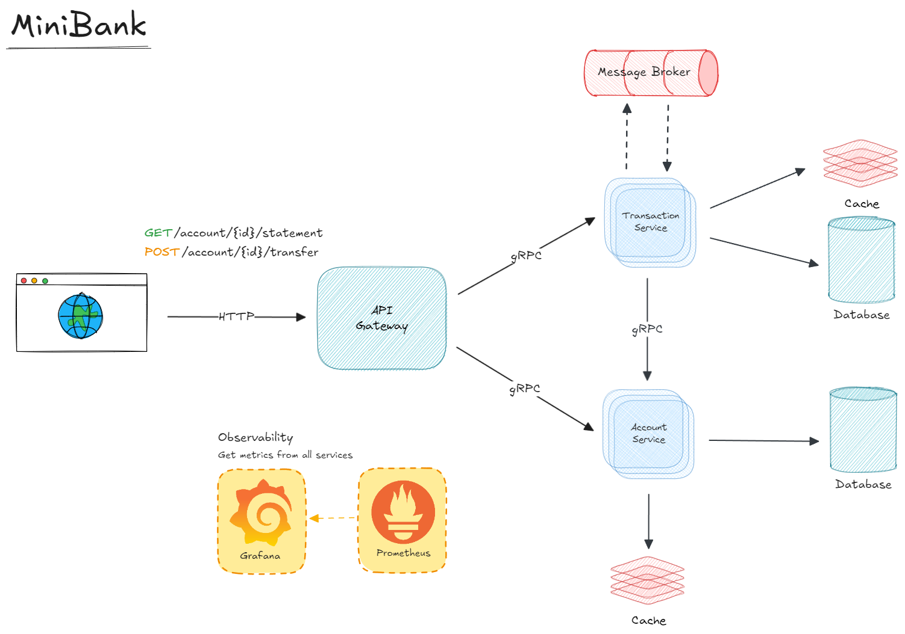

# Mini Bank

Mini Bank is a microservices-based application that provides a simple banking system with features such as account creation, balance transfer, and account retrieval. The application is designed using a microservices architecture, where each service is responsible for a specific business function.

## Architecture

The architecture of Mini Bank consists of the following microservices:

1. `svc-transaction`: This service is responsible for handling all the transaction-related operations, such as `DEPOSIT`, `TRANSFER`, and `WITHDRAWAL`. It serves `GRPC` methods.
2. `svc-account`: This service manages the account-related operations, such as account details retrieval, creating, and updating balances. It serves `GRPC` methods.
3. `api-gateway`: This service is responsible for centralizing user requests and orchestrating redirects to the necessary services. It serves `HTTP` endpoints.

## Diagrams

### Architecture Diagram



### Sequence Diagram for Transfer operation


## Getting Started

To get started with Mini Bank, follow these steps:

1. Clone the repository:

   ```bash
   git clone https://github.com/buemura/minibank.git
   ```

2. Setup environment

   ```bash
   sh env_up.sh

   ```

3. Install services dependencies

   ```bash
    # API gateway
    cd apps/api-gateway && go mod tidy && cp .env.example .env
    # Account Service
    cd apps/svc-account && go mod tidy && cp .env.example .env
    # Transaction Service
    cd apps/svc-transaction && go mod tidy && cp .env.example .env
   ```

4. Start services
   ```bash
    # API gateway
    cd apps/api-gateway && go run cmd/http/main.go
    # Account Service GRPC
    cd apps/svc-account && go run cmd/grpc/main.go
    # Transaction Service GRPC
    cd apps/svc-transaction && go run cmd/grpc/main.go
    # Transaction Service Consumer
    cd apps/svc-transaction && go run cmd/consumer/main.go
   ```
